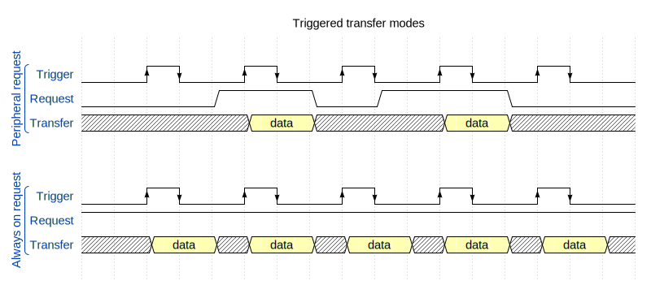

##Component Overview

This section provides the overview of component settings.

##General Configuration

The general configuration of the eDMA component defines the behavior of the eDMA controller and the initialization of the associated DMAMUX device.  
*Note:* The initialization function `EDMA_init()` enables the minor loop map feature by default (control register `DMA_CR[EMLM] = 1`). 

##DMA Overview Table

The DMA overview table displays all configured DMA channels of the selected instance of the DMA peripheral used in all components and functional groups of the selected project.

##eDMA Channels

The eDMA channels settings are used for initialization of the eDMA API mode and DMAMUX request, triggers and transfer control descriptors.
The corresponding setting depends on the selected *Channel API mode*.

###Channel API Modes

Each eDMA channel can be initialized independently with one of the following API modes:
- **Transactional** - Supports transfer configuration with transactional handle, callback functions and scatter-gather operation mode. This mode does not support channel linking.
- **Non-transactional (API functions)** - Supports eDMA driver API functions used for transfer configuration (TCD is initialized progressively). This mode supports neither full TCD structure initialization nor scatter-gather processing.
- **Non-transactional (TCD structures)** - Supports initialization of whole TCD structures (direct write of TCD registers). This mode also allows the definition of several TCDs (array of TCDs) for the scatter-gather operation mode.

####Transactional Channel API Mode
The transactional mode supports initialization of the transfer configuration with transactional handle, callback functions and scatter-gather operation mode.  
The eDMA  handle is mainly used by peripheral drivers to process automatic data transfers (for example, communication driver for processing received and transmitted 
data blocks). The callback functions can be also specified and initialized in this mode.  
*Note:* The transfer configuration in this mode is limited and channel linking is not supported (no full TCD support).
The *TCD Pool* enables the use of allocated memory for the scatter-gather mode of the eDMA (TCD loading from the memory pool). When the initialization of the TCD
pool is enabled, the memory allocation of the TCD is provided (size, memory allocation and assignment to the handle and installation as the TCD).
The TCD Pool is used by the driver to store all submitted transfers, ensuring their process by the eDMA in the scatter-gather mode.  
*Note:* This mode enables automatically the eDMA channel interrupt data transfer processing and callback function invocation.

####Non-transactional Channel API Modes

The non-transactional modes are based on the **Transfer Control Descriptor (TCD)** that specifies the data movement operation of the eDMA channel.

All transfer attributes for a channel are defined in the channel's unique TCD. Each TCD is stored in the
eDMA controller's local SRAM. Only the *DONE*, *ACTIVE*, and *STATUS* fields are initialized at reset.
All other TCD fields are undefined at reset and must be written by software before the channel is
activated. Failure to do this will result in unpredictable channel behavior. If a channel's TCD 
is configured with an invalid value or an invalid combination of values, a channel error will be reported in the *DMAERR* register.

Transfer control descriptor is organized to support two-deep, nested transfer operations:
- An inner data transfer loop (minor loop - see chapter below) defined by a minor byte transfer count (*NBYTES*).  
- An outer data transfer loop (major loop - see chapter below) defined by a major iteration count (*CITER*).

32-byte TCD is stored in local memory for each channel and features. TCDs can be processed in a chain so that the eDMA will automatically
load the next TCD (channel linking). You can find the TCD memory map in the reference manual. The non-transactional mode of the eDMA peripheral 
component provides full TCD configuration, which corresponds with TCD structure.  

###eDMA Request and Trigger

These settings enable the selection of a peripheral request through the DMAMUX device and a trigger. The request can be disabled (for example when software triggering 
of the channel is used) or always enabled to support periodic trigger only.  
*Note:* The channel trigger is not supported on all MCUs and only on several channels (0 - 3).

**Peripheral request** - In this mode, an eDMA source of the peripheral request is routed directly to the specified eDMA channel. 
The operation of the DMAMUX in this mode is completely transparent to the system. An eDMA source transfers are triggered by the selected peripheral request source
(for example when received data are available in FIFO).  
To activate this mode, select the following in the eDMA channel:  
- **eDMA request:** *#request number: peripheral request name*  

**Peripheral triggered request** - In this mode, an eDMA source may only request a DMA transfer with triggering (for example, when a transmit buffer becomes empty or a receive
buffer becomes full). The trigger configuration is MCU-specific. If available, the period is configured in the Periodic Interrupt Timer (PIT), otherwise the trigger is configured in the Pins tool (MCU-specific). The triggering capability is mostly used for periodically polling external devices on a particular bus or for
using the GPIO ports to drive or sample waveforms.  
To activate this mode select the following in eDMA channel:  
- **eDMA request:** *#request number: peripheral request name*  
- **Enable periodic trigger** ☑  
- If available, initialize *PIT* component and specific **channel number**, which corresponds with the selected **eDMA channel** number or configure the trigger
in the Pins tool(MCU-specific timers).  

**Always on request** - In this mode, the DMA request is always asserted and the DMA channel is controlled (triggered) by the software. When the request of the
DMA channel is enabled, both minor and major loops are processed continuously.
Always on is mostly useful to perform any DMA transfer that requires software activation, DMA transfers to/from GPIO, from memory to memory, from memory to 
the external bus, or vice-versa.  
To activate this mode select the following in eDMA channel:  
- **eDMA request:** *DMAMUX always on* or *AlwaysOnXY*  

*Note:* When the eDMA request is configured as "Always On", then the peripheral DMA sources (requests) for selected channel are ignored.

**Always on triggered request** - In this mode, the DMA request is always asserted with triggering (trigger is used for starting DMA requests). 
Figure 1 shows the difference between peripheral trigger and the always on trigger mode.  
To activate this mode select the following in eDMA channel:  
- **eDMA request:** *DMAMUX always on* or *AlwaysOnXY*  
- **Enable periodic trigger** ☑  
- If available, initialize *PIT* component and specific **channel number**, which corresponds with the selected **eDMA channel** number or configure the trigger
in the Pins tool (MCU-specific).  

**Disabled request** - In this mode, the DMAMUX channel is disabled. Since the channels are
disabled and enabled primarily via the eDMA configuration registers, this mode is used
mainly as the reset state for an eDMA channel in the DMAMUX. It may also be used
to temporarily suspend an eDMA channel while reconfiguration of the system takes place (for example, changing the period of a DMA trigger).
This mode can be also used for software activation of the channel for every minor loop (for example, every minor loop is started by using the *START* bit of the eDMA channel).  
To activate this mode select the following in eDMA channel:  
- **eDMA request:** *DMAMUX disable* or *Disable*  

   
 
**Figure 1.** *Trigger transfer modes: Peripheral and always on triggered modes transfer examples*

###Channel Priority and Preemption

Only one channel can actively perform a transfer at any given time. Therefore, to handle multiple pending
transfer requests the eDMA controller offers channel prioritization. Fixed-priority or round-robin (**General configuration**)
prioritization can be selected.  

In the **fixed-priority** scheme, each channel has an assigned priority level. When multiple requests are
pending, channel with the highest priority level performs its transfer first. By default, fixed priority
arbitration is implemented, with each channel being assigned a priority level equal to its channel
number. Other priority levels can be assigned if required. Higher-priority channels can preempt lower-priority channels. Preemption takes place when a channel is performing a transfer while a transfer request is
assigned to a channel of a higher priority. In this case, the lower-priority channel halts its transfer and
allows the higher-priority channel to carry out its transfer. The lower-priority channel then resumes its
transfer after the higher-priority channel has completed its transfer. One level of preemption is
supported. Preemption is a setting that must be enabled on a per-channel basis if required.  

In the **round-robin** mode, the eDMA cycles through the channels in order, checking for a pending request.
When a channel with a pending request is reached, it is allowed to perform its transfer. Once the
transfer is completed, the eDMA continues to cycle through the channels looking for the next
pending request.  

###Minor and Major Transfer Loops

Each time a channel is activated and executes, a *number of bytes (NBYTES)* are transferred from the
source to the destination. This is referred to as a **minor transfer loop**. On completion of the minor loop,
excluding the final minor loop, the eDMA carries out the following tasks:  
- Decrementing the *current iteration (CITER)* counter.  
- Updating the *source address (SADDR)* by adding the current source address to the signed *source offset (SOFF)*:
*SADDR = SADDR + SOFF* (source address is updated automatically as transfers are
performed. On completion of the minor loop, the source address contains source address for
the last piece of data that was read in the minor loop; offset is added to this value).
- Updating the *destination address (DADDR)* by adding the current destination address to the signed *destination offset (DOFF)*: *DADDR = DADDR + DOFF*.
- Updating channel status bits and requesting (enabled) interrupts.
- Asserting the start bit of the linked channel upon completion of minor loop, if channel linking is enabled.

A **major transfer loop** consists of a number of minor transfer loops. This number is specified within the *TCD* (Transfer Control Descriptor).
As iterations of the minor loop are completed, the *current iteration (CITER)* TCD field is decremented. When the current iteration
field has been exhausted, the channel has completed a major transfer loop. On completion of the major/final minor loop, the eDMA performs the following actions:  
- Updates the source address by adding the current source address to the *last source address adjustment (SLAST)*: *SADDR = SADDR + SLAST*.  
- Updates destination address by adding the current destination address to the *last destination address adjustment (DLAST)*: *DADDR = DADDR + DLAST*.  
- Updates the channel status bits and requesting (enabled) interrupts.  
- Asserts the start bit of the linked channel upon completion of major loop, if channel linking is enabled.  
- Reloads the current iteration *(CITER)* from the beginning of the major iteration count *(BITER)* field.  

**Figure 2.** *Nested loop - major and minor transfer loops*

###Channel Linking on Minor and Major Loop Completion

After the channel completes the minor loop and the channel is linked to another channel (**Linked minor loop channel**), the link
target channel initiates a channel service request via an internal mechanism that sets the
*START* bit of the specified channel. The channel link is made after each iteration of the minor loop except for
the last. The last iteration is configured as channel linking on completion of the major loop.  
Once the channel completes the major loop and the channel is linked to another channel (**Linked major loop channel**), the link
target channel initiates a channel service request via an internal mechanism that sets the
*START* bit of the specified channel. Both the channel linking on the minor and the major loop can be enabled for the same
channel.
